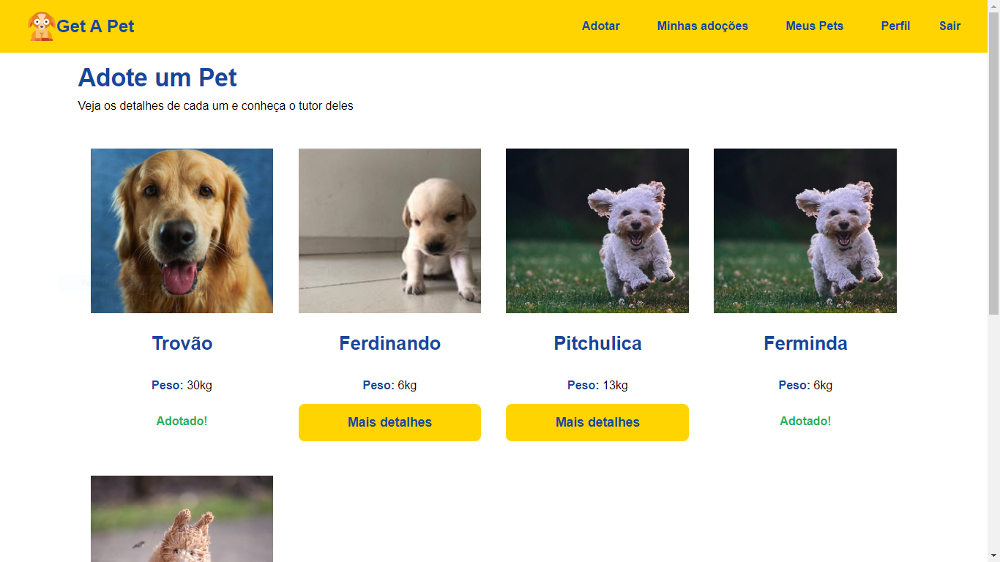

# Projeto "Get A Pet"

O projeto "Get A Pet" é uma plataforma que visa facilitar o processo de adoção de animais de estimação. Através de uma aplicação web, os usuários podem cadastrar seus pets disponíveis para adoção, bem como procurar e adotar pets que estejam buscando um novo lar.

A plataforma oferece um sistema de autenticação seguro, permitindo que os usuários realizem o cadastro e o login por meio de tokens, garantindo a proteção das informações pessoais.

Ao cadastrar um pet, o usuário pode inserir informações relevantes, como nome, idade, peso, cor e imagens do animal, possibilitando que os potenciais adotantes conheçam melhor cada pet disponível para adoção.

Além disso, os usuários têm a possibilidade de editar seus perfis, o que inclui adicionar uma foto de perfil, alterar senha, email e nome de usuário, permitindo a personalização das informações.

O principal destaque do projeto é o sistema de adoção, que é o coração da plataforma. Os usuários podem procurar pets disponíveis para adoção e, caso encontrem um animal de estimação adequado, eles podem solicitar a adoção. Após a solicitação, o usuário responsável pelo cadastro do pet receberá a notificação e poderá concluir o processo de adoção.

Tecnologicamente, o projeto foi desenvolvido utilizando diversas tecnologias modernas. No front-end, foi utilizado React e Router Dom 
para a criação de interfaces dinâmicas e interativas. Já no back-end, foram empregadas as tecnologias Node e Express.js para construir uma API robusta e eficiente. Para a estilização do projeto, o CSS foi utilizado para criar um layout atraente.

Para garantir a segurança das informações dos usuários, o projeto conta com recursos como o bcrypt para criptografar senhas e o jsonwebtoken para autenticar e autorizar as ações dos usuários.

<div align='center'>
  
  
  
  
  
</div><br/><br/>

## Tecnologias utilizadas no projeto 💻

### `Node.js` 🗃
* Express
* CORS
* bcrypt
* cookie-parser
* Multer
* jsonwebtoken
* mongoose

### `React` ❄
* Custom Hooks
* Context API
* React Icons
* Axios
* React Router Dom

### `CSS` 🎨
</br></br>

## 🗃 Rodando a aplicação no back-end
```bash
# Clone este repositório
$ git clone git@github.com:Klosban/getapet.git

# Vá para a pasta backend
$ cd backend

# Instale as dependências
$ npm install

# Execute a aplicação

O servidor inciará na porta: 5000 - acesse http://localhost:5000
```
## 🗃 Rodando a aplicação no front-end
```bash
# Vá para a pasta frontend
$ cd frontend

# Instale as dependências
$ npm install

# Execute a aplicação

A aplicação irá se iniciar na porta: 3000 - acesse http://localhost:3000
```

